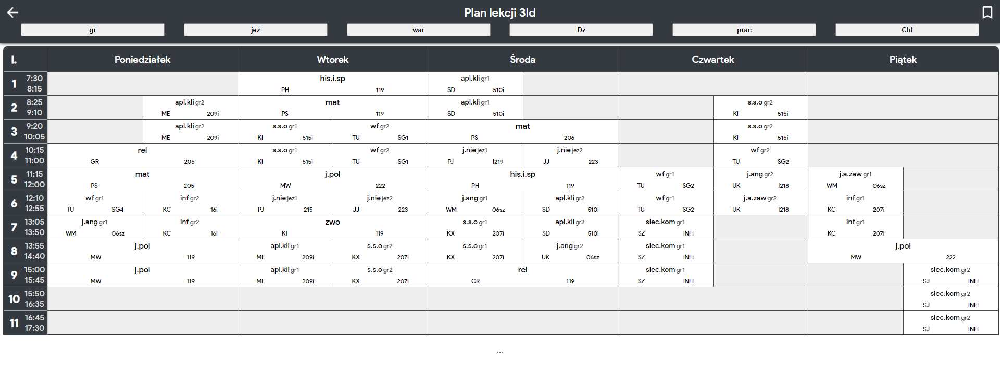
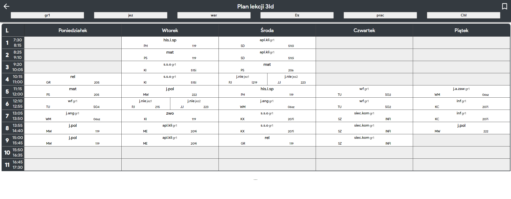
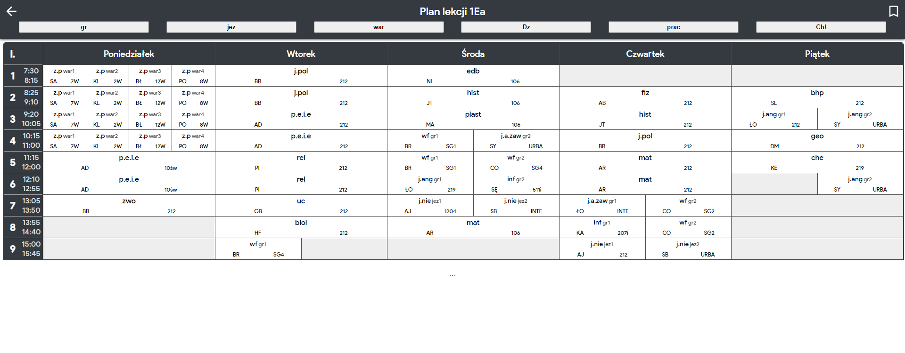
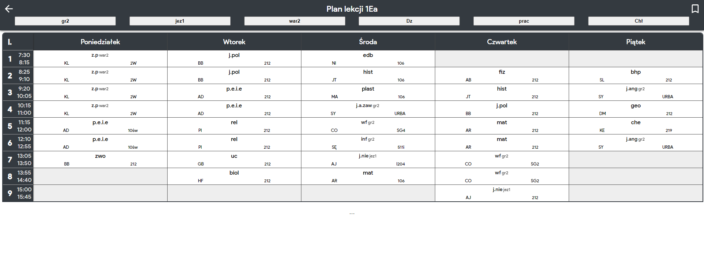

  
  <h1>ZSŁ plan toolbox</h1>

Aby ten skrypcik działał, trzeba mieć w swojej przeglądarce zainstalowany dodatek [Tampermonkey](https://www.tampermonkey.net/).
Jeśli masz już zainstalowany dodatek, to naciśnij [tutaj](https://raw.githubusercontent.com/Pawloland/ZSL-plan-toolbox/master/plan-toolbox-release.user.js), żeby zainsatlować skrypt.

## Screenshoty

