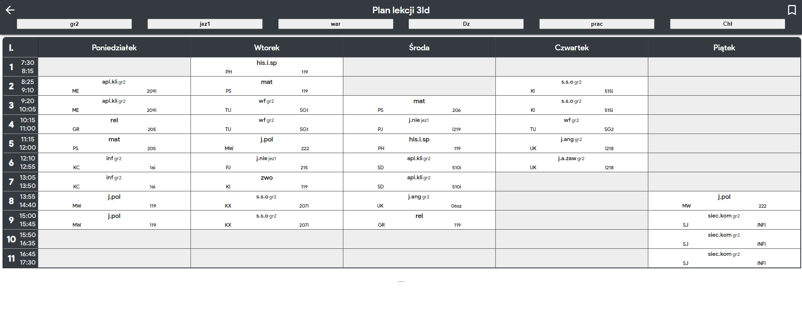

  
  <h1>ZSŁ plan toolbox</h1>

Aby ten skrypcik działał, trzeba mieć w swojej przeglądarce zainstalowany dodatek [Tampermonkey](https://www.tampermonkey.net/).

Jeśli masz już zainstalowany dodatek, to naciśnij [tutaj](https://raw.githubusercontent.com/Pawloland/ZSL-plan-toolbox/master/plan-toolbox-release.user.js), żeby zainsatlować skrypt.

Teraz gdy przejdziesz na konkretną stronę z planem lekcji jakiejś klasy to pojawią ci się nowe przyciski, które po kliknięciu, będą ukrywać niepotrzebne grupy.

**Uwaga!**
Jeżeli nie pojawiają Ci się przyciski, to odświęż stronę, będąc na konkretnym planie lekcji klasy, poprzez:
* wciśnięcie F5 lub
* wciśnięcie ctrl+F5 (wymusi ponowne pobranie strony, nie załaduje jej z cache) albo
* ponowne wysłanie adresu URL do danego planu z paska adresu strony w przeglądarce

## Screenshoty

